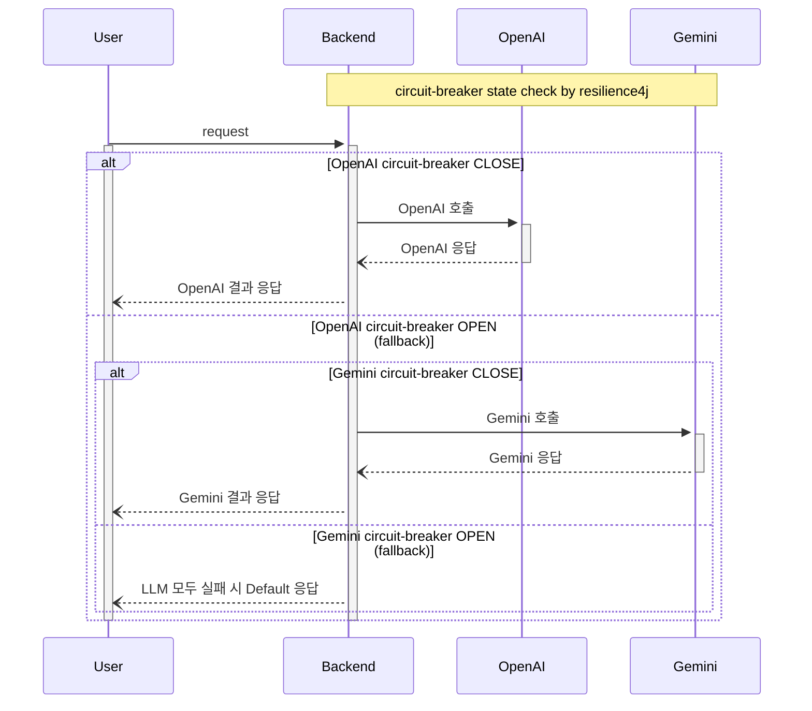

## ️️Sequence Diagram

```mermaid
sequenceDiagram
    participant User
    participant Backend
    participant OpenAI
    participant Gemini

    Note over Backend,Gemini: circuit-breaker state check by resilience4j
    User->>+Backend: request
    activate User
    activate Backend
    activate OpenAI
    
    alt OpenAI circuit-breaker CLOSE
        Backend->>+OpenAI: OpenAI 호출
        OpenAI--)Backend: OpenAI 응답
        deactivate OpenAI
        Backend--)User: OpenAI 결과 응답
        
    else OpenAI circuit-breaker OPEN (fallback)
        alt Gemini circuit-breaker CLOSE
            activate Gemini
            Backend->>+Gemini: Gemini 호출
            Gemini--)Backend: Gemini 응답
            deactivate Gemini
            Backend--)User: Gemini 결과 응답
        else Gemini circuit-breaker OPEN (fallback)
            Backend--)User: LLM 모두 실패 시 Default 응답
        end
    end

    deactivate Backend
    deactivate User
```
